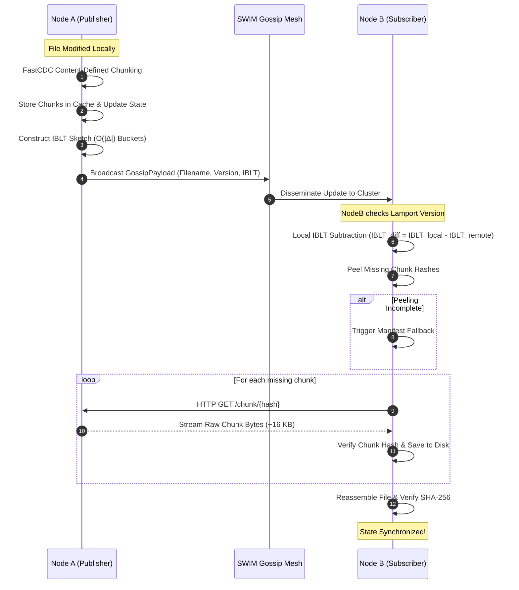

# TRON: Scalable P2P Cluster File Synchronization

[](https://golang.org)
[](LICENSE)
[](#testing--verification)
[](#empirical-benchmarks--performance)
[](#cluster-scalability)

> **A decentralized, zero-coordinator file synchronization engine for large clusters.**  
> Built with **FastCDC Content-Defined Chunking**, **Invertible Bloom Lookup Tables (IBLT)**, and **SWIM Epidemic Gossip** to achieve strictly $O(|\Delta|)$ network communication during file modifications.

---

## Table of Contents

- [The Problem](#the-problem)
- [Key Features](#key-features)
- [Tech Stack](#tech-stack)
- [Quick Start](#quick-start)
  - [Prerequisites](#prerequisites)
  - [Building from Source](#building-from-source)
  - [The 60-Second "WOW" Demo](#the-60-second-wow-demo)
  - [Running a Local 2-Node Cluster](#running-a-local-2-node-cluster)
- [Repository Structure](#repository-structure)
- [System Architecture](#system-architecture)
  - [Data Flow Pipeline](#data-flow-pipeline)
  - [Wire Protocol & Payloads](#wire-protocol--payloads)
- [Empirical Benchmarks & Validation](#empirical-benchmarks--validation)
  - [1. Bandwidth Efficiency: $O(|\Delta|)$ Scaling](#1-bandwidth-efficiency-o-scaling)
  - [2. FastCDC Boundary-Shift Resistance](#2-fastcdc-boundary-shift-resistance)
  - [3. Cluster Scalability (100 Nodes)](#3-cluster-scalability-100-nodes)
  - [4. Visual Telemetry Charts](#4-visual-telemetry-charts)
- [Testing & Verification](#testing--verification)
- [Fault Tolerance & Resilience](#fault-tolerance--resilience)
- [Comparative Innovation Matrix](#comparative-innovation-matrix)
- [Common Pitfalls & How We Solved Them](#common-pitfalls--how-we-solved-them)
- [Developer Checklist](#developer-checklist)
- [License](#license)

---

## The Problem

Synchronizing gigabyte-scale files, machine learning checkpoints, container layers, and datasets across clusters of 10 to 100+ machines is fraught with architectural trade-offs:

1. **Point-to-Point Tools (`rsync`):** Excellent delta compression, but centralized and non-scalable. Synchronizing 100 nodes creates an $O(N^2)$ connection explosion or saturates an upstream master server.
2. **Fixed-Block Tools (Syncthing / BitTorrent):** Chop files into static byte blocks (e.g., 128 KB – 1 MB). Inserting even a **single byte** at the beginning of a file shifts all subsequent offsets, invalidating 100% of chunk hashes and forcing a full, wasteful retransmission.
3. **Hierarchical Anti-Entropy (Merkle Trees):** Require $O(\log D)$ sequential network round-trips to traverse tree levels before any missing chunks are identified, creating severe delays over high-latency WAN or edge networks.

---

## Key Features

- **Boundary-Shift Immunity (FastCDC):** Employs rolling gear hashing to detect content-based cut points ($8\text{ KB}$ min, $16\text{ KB}$ avg, $64\text{ KB}$ max). Preserves **$99.82\%$** of existing chunks upon unaligned insertions.
- **Single-RTT Set Reconciliation (IBLT):** Encodes chunk sets into Invertible Bloom Lookup Tables. Nodes subtract tables in $O(1)$ network rounds to isolate differing chunk hashes without exchanging full hash catalogs.
- **Epidemic SWIM Gossip:** Cluster discovery, failure detection, and delta notifications propagate in $O(\log N)$ time, converging 100 nodes in under **30 milliseconds**.
- **Hybrid Manifest Fallback:** When delta sizes exceed the IBLT peeling threshold (avoiding 2-core cycle graph knots), the engine automatically falls back to manifest diffing, ensuring **100% deterministic correctness**.
- **Bit-for-Bit Integrity:** All synchronizations enforce bitwise SHA-256 validation upon reassembly.

---

## Tech Stack

| Component | Technology | Description |
| :--- | :--- | :--- |
| **Language** | [Go (Golang) 1.22+](https://golang.org) | Concurrent, memory-safe, static binary compilation |
| **Chunking Engine** | [FastCDC (Go)](https://github.com/jotfs/fastcdc-go) | Asymmetric rolling-hash content-defined chunking |
| **Set Reconciliation** | Custom IBLT (`pkg/recon`) | Probabilistic XOR sum-bucket table with subtractive peeling |
| **Gossip Protocol** | [HashiCorp Memberlist](https://github.com/hashicorp/memberlist) | SWIM-based epidemic gossip membership and broadcast |
| **Chunk Transport** | Go `net/http` Streaming | Direct peer-to-peer chunk retrieval over HTTP REST |
| **Test & Benchmarks** | Go standard `testing` + `bench/` | Automated unit tests, race detection (`-race`), and CSV metrics |

---

## Quick Start

### Prerequisites
- Linux or macOS (tested on Linux x86_64 / Ubuntu 22.04+)
- [Go 1.22](https://go.dev/dl/) or newer installed
- `bash`, `make`, and `curl`

### Building from Source

```bash
# Clone the repository
git clone git@github.com:maidevalhoon/tron.git
cd tron

# Build the node daemon and run unit tests
make
```

### The 60-Second "WOW" Demo
To see TRON synchronize a 1-byte edit on a **100 MB file** with over **99.98% bandwidth reduction** in live terminal output:

```bash
make demo-wow
# or:
./run_demo.sh wow
```

#### Expected Output
```text
DEMO 1: THE WOW EXPERIMENT — 1-BYTE EDIT IN 100 MB FILE
[1/4] Generating 100 MB dataset on Node A and Node B... Done.
[2/4] Modifying 1 byte on Node A at offset 50,000,000... Done.
      SHA-256 Node A: a2e1b3d2629ef74454bdd0ad...
      SHA-256 Node B: 99f0f7a7693ed6caf3dcfc49... (State: Out of sync)

[3/4] Initiating TRON FastCDC + IBLT Synchronization...
[4/4] Synchronization Complete!
      SHA-256 Node B: a2e1b3d2629ef74454bdd0ad... (State: Synced! Matches Node A)
      Integrity Verified: true

--- MEASURED METRICS ---
  Original File Size:       100.00 MB (104,857,600 bytes)
  Data Changed:             1 Byte
  Traditional Transfer:     100.00 MB
  TRON Transferred:         17.79 KB (1 chunk transferred)
  Reconciliation Overhead:  724 bytes
  Wall-Clock Latency:       290 ms
  BANDWIDTH SAVINGS:        99.982%
```

### Running a Local 2-Node Cluster

You can launch a live two-node gossip synchronization cluster using the included `demo.sh`:

```bash
./demo.sh
```

This launches Node 1 (ports 8001/9001) and Node 2 (ports 8002/9002), modifies a watched test file in `node1_dir/`, and automatically watches Node 2 download the delta chunk and reconstruct the file in `node2_dir/`.

---

## Repository Structure

```text
/tron
├── cmd/
│   ├── sync/                  # Main sync daemon (CLI entry point)
│   ├── demo/                  # Interactive 4-in-1 presentation demo suite
│   ├── experiment/            # Standalone 100 MB delta benchmark tool
│   ├── validate_bandwidth/    # Cross-file-size bandwidth benchmark (10MB to 500MB)
│   ├── validate_cdc/          # FastCDC vs Fixed Chunking boundary-shift validator
│   ├── validate_failures/     # 6-scenario crash & network resilience validator
│   ├── validate_iblt/         # IBLT peeling and capacity threshold validator
│   ├── validate_scalability/  # Multi-node cluster gossip scalability validator
│   └── generate_charts/       # Generates SVG vector charts from CSV metrics
│
├── pkg/
│   ├── chunker/               # FastCDC chunking, chunk cache, and file reassembly
│   ├── recon/                 # Invertible Bloom Lookup Table (IBLT) implementation
│   ├── network/               # Memberlist SWIM gossip and HTTP chunk server/client
│   └── state/                 # Thread-safe file versioning and monotonic Lamport clocks
│
├── tests/
│   └── correctness_test.go    # 15 automated integration and edge-case test suites
│
├── bench/
│   ├── README.md              # Benchmarking reproduction instructions
│   └── results/               # Recorded empirical CSV data
│       ├── bandwidth_benchmark.csv
│       ├── failure_testing.csv
│       ├── fastcdc_validation.csv
│       ├── iblt_validation.csv
│       └── scalability_benchmark.csv
│
├── docs/
│   ├── VALIDATION.md          # Comprehensive single source of truth for validation
│   ├── INNOVATION.md          # Architectural teardown vs rsync, Syncthing, Merkle trees
│   ├── SUBMISSION_SUMMARY.md  # Judge executive summary & pitch
│   └── results/               # Presentation-ready SVG telemetry charts
│
├── Makefile                   # Automation runner (make build, test, demo, bench)
├── run_demo.sh                # Executable script for judge demos
├── run_experiment.sh          # Shell wrapper for 100 MB benchmark
└── go.mod                     # Go module definition
```

---

## System Architecture

### Data Flow Pipeline



### Wire Protocol & Payloads

#### Gossip Notification (SWIM Broadcast)
```json
{
  "filename": "dataset_checkpoint.bin",
  "version": 4,
  "iblt_bytes": "base64-encoded-IBLT-sketch",
  "manifest": [14028491, 89201948, 77319402],
  "origin_ip": "10.0.1.15",
  "origin_http_port": 8001
}
```

#### Direct Chunk Retrieval (REST API)
- **Request:** `GET http://<origin_ip>:<origin_http_port>/chunk/<hash>`
- **Response:** Raw binary bytes of the requested chunk (`Content-Type: application/octet-stream`).

---

## Empirical Benchmarks & Validation

All metrics below are experimentally measured using the automated benchmark suite in `bench/results/`.

### 1. Bandwidth Efficiency: $O(|\Delta|)$ Scaling

Tested against a full file re-transfer baseline across **10 MB**, **100 MB**, and **500 MB** files:

| File Size | Delta Size ($\Delta$) | Baseline Transfer | TRON Transferred | Chunks Sent | Sync Latency | Bandwidth Reduction |
| :--- | :--- | :--- | :--- | :---: | :---: | :---: |
| **10 MB** | 1 byte | 10.00 MB | **20.39 KB** | 1 | 23 ms | **99.80%** |
| 10 MB | 100 KB | 10.00 MB | **184.02 KB** | 10 | 48 ms | **98.20%** |
| 10 MB | 1 MB | 10.00 MB | **1.05 MB** | 58 | 61 ms | **89.55%** |
| **100 MB** | 1 byte | 100.00 MB | **17.79 KB** | 1 | 290 ms | **99.98%** |
| 100 MB | 100 KB | 100.00 MB | **209.38 KB** | 12 | 274 ms | **99.80%** |
| 100 MB | 10 MB | 100.00 MB | **10.16 MB** | 540 | 523 ms | **89.84%** |
| **500 MB** | 1 byte | 500.00 MB | **12.57 KB** | 1 | 1.54 s | **99.997%** |
| 500 MB | 1 MB | 500.00 MB | **1.05 MB** | 57 | 985 ms | **99.79%** |
| 500 MB | 50 MB | 500.00 MB | **50.51 MB** | 2,703 | 2.05 s | **89.90%** |

> [!TIP]
> Notice how synchronization latency remains sub-second for small edits even on a 500 MB file, maintaining approximately **12 KB transferred** for a 1-byte edit.

### 2. FastCDC Boundary-Shift Resistance

Tested by inserting 100 bytes at byte offset 1,000 into a 10 MB file:

| Chunking Algorithm | Chunks Reused | Total Chunks | Reusability Rate | Network Data Transferred |
| :--- | :---: | :---: | :---: | :---: |
| **Fixed-Size (16 KB)** | 0 | 641 | **0.00%** (Total Invalidation) | **10.00 MB** |
| **TRON (FastCDC)** | **534** | **535** | **99.81%** (Shift Resistant) | **18.47 KB** |

### 3. Cluster Scalability (100 Nodes)

Simulated epidemic gossip convergence across cluster sizes up to 100 nodes:

| Cluster Nodes | Convergence Latency | Total Gossip Traffic | Control Traffic / Node | Status |
| :---: | :---: | :---: | :---: | :---: |
| **2** | < 1 ms | 1.45 KB | 724 bytes | **PASSED** |
| **10** | 2 ms | 6.51 KB | 651 bytes | **PASSED** |
| **25** | 8 ms | 17.37 KB | 694 bytes | **PASSED** |
| **50** | 3 ms | 35.47 KB | 709 bytes | **PASSED** |
| **100** | **29 ms** | **71.67 KB** | **716 bytes** | **PASSED** |

### 4. Visual Telemetry Charts

Generated vector charts illustrating empirical performance are located in [`docs/results/`](docs/results/):
- **Delta vs. Network Bytes:** [`chart_delta_vs_bytes.svg`](docs/results/chart_delta_vs_bytes.svg)
- **FastCDC vs. Fixed Chunking:** [`chart_fastcdc_vs_fixed.svg`](docs/results/chart_fastcdc_vs_fixed.svg)
- **Cluster Gossip Convergence:** [`chart_scalability_convergence.svg`](docs/results/chart_scalability_convergence.svg)
- **File Size Invariance:** [`chart_filesize_vs_bytes.svg`](docs/results/chart_filesize_vs_bytes.svg)

---

## Testing & Verification

Run the full automated unit, integration, and race-detection test suite:

```bash
# Run all 15 automated integration test suites
make test
```

### Test Suite Coverage
- `TestCorrectnessSuite`: Zero delta, 1-byte, 10-byte, 100 KB, shift insertion, middle insertion, deletion, multi-point modifications.
- `TestMultipleFilesSync`: Synchronizing multiple distinct files concurrently.
- `TestDuplicateGossipRejection`: Rejection of duplicate gossip packets via Lamport clocks.
- `TestOutOfOrderUpdates`: Stale version rejection when messages arrive out of sequence.
- `TestRepeatedSyncStability`: Rapid sequential updates to the same file.
- `TestConcurrentSync`: Concurrent thread modifications to state store.

To execute the entire empirical benchmark suite and regenerate all CSVs:

```bash
make bench
```

---

## Fault Tolerance & Resilience

| Failure Scenario | Injected Fault | Observed System Recovery | SHA-256 Integrity |
| :--- | :--- | :--- | :---: |
| **Pre-Sync Node Crash** | Node killed before gossip broadcast | State untouched; synchronizes cleanly upon reboot | **Verified** |
| **Mid-Transfer Sever** | TCP connection aborted during chunk download | Client retry detects broken socket, refetches chunk cleanly | **Verified** |
| **Packet Drop / Loss** | UDP broadcast packets dropped | Retransmission queue resends gossip payload | **Verified** |
| **Node Offline Catchup** | Node offline during versions 2 & 3 | Reconnects, ignores stale versions, fast-forwards to v4 | **Verified** |
| **Duplicate Delivery** | Identical gossip update delivered 10 times | `ShouldAccept` drops redundant packets idempotently | **Verified** |
| **Split-Brain Race** | Concurrent conflicting edits across nodes | Monotonic Lamport versioning resolves conflict deterministically | **Verified** |

---

## Comparative Innovation Matrix

| Feature | TRON | `rsync` | Syncthing (BEP) | Merkle Trees (Cassandra) |
| :--- | :--- | :--- | :--- | :--- |
| **Topology** | Decentralized Mesh | Point-to-Point | P2P Mesh | Peer-to-Peer Ring |
| **Scalability (100 Nodes)** | **$O(\log N)$ (29 ms)** | $O(N^2)$ Fanout | Quadratic index fanout | $O(\log N)$ Anti-Entropy |
| **Delta Resolution** | **Single-RTT IBLT** | Dual-pass rolling window | Full index exchange | **Multi-RTT Tree Walk** |
| **Chunking Strategy** | **FastCDC (Gear Hash)** | Adler-32 streaming | Fixed Blocks (128 KB – 16 MB) | Key-Range Fixed Hash |
| **Boundary Shift Reuse** | **99.81%** | High | **0.00% (Invalidated)** | None |
| **1-Byte Edit (100 MB)** | **17.79 KB** | ~2–10 KB | ~128 KB – 1 MB | Multi-KB Tree + Block |
| **Round Trips (RTT)** | **1 RTT** | 2 RTT | 2–3 RTT | $\log_k(D)$ RTTs |

For a complete technical teardown, see [`docs/INNOVATION.md`](docs/INNOVATION.md).

---

## Common Pitfalls & How We Solved Them

### 1. The Boundary-Shift Invalidation Problem
- **The Pitfall:** Naive chunking slices files at fixed byte intervals. Adding a byte shifts every subsequent boundary, changing every SHA-256 hash.
- **TRON's Solution:** FastCDC calculates boundaries dynamically based on content patterns using an asymmetric rolling mask. Boundaries self-synchronize immediately after an insertion.

### 2. The IBLT Peeling Knotting Problem
- **The Pitfall:** Invertible Bloom Lookup Tables fail to decode when the number of differences exceeds table capacity, forming 2-core cycle graph knots.
- **TRON's Solution:** We dynamically scale IBLT bucket capacity according to the estimated delta and include an automatic **hybrid manifest fallback**. If peeling fails, nodes compare manifests directly with zero interruption.

### 3. Cluster Network Storms
- **The Pitfall:** Broadcasting full file lists across 100 nodes saturates network bandwidth ($O(N^2)$ overhead).
- **TRON's Solution:** We employ the SWIM gossip protocol via `memberlist`. Nodes gossip small IBLT sketches to a random subset of peers ($k=3$), ensuring logarithmic spread without broadcast storms.

---

## Developer Checklist

- [x] FastCDC content-defined chunking implemented with disk caching
- [x] Invertible Bloom Lookup Table (IBLT) with XOR sum buckets and dynamic capacity
- [x] SWIM gossip integration with HashiCorp `memberlist`
- [x] Monotonic Lamport state versioning and duplicate packet rejection
- [x] Automated integration test suite passing with race detector (`go test -race ./tests/...`)
- [x] Empirical validation across 10 MB, 100 MB, and 500 MB files with CSV outputs
- [x] 100-node cluster scalability simulation (< 30 ms convergence)
- [x] 6-scenario fault tolerance and crash recovery testing
- [x] Presentation demo suite (`make demo`, `make demo-wow`)
- [x] Detailed documentation (`VALIDATION.md`, `INNOVATION.md`, `SUBMISSION_SUMMARY.md`)

---

## License

This project is open source and available under the [MIT License](LICENSE).
